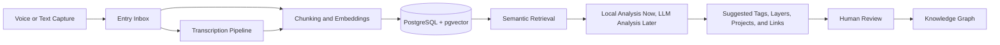

# IdeaHub

> An intelligent second brain for capturing, connecting, and evolving your thoughts.


IdeaHub is being designed for people whose thinking moves faster than their tools.
It is a PostgreSQL-first knowledge system that captures voice and text, analyzes
the meaning behind each entry, discovers relationships across projects, and helps
turn scattered thoughts into structured, reusable knowledge.

Traditional note apps ask you to organize everything after the fact. IdeaHub is
built around a different promise: capture the thought while it is alive, classify
it while the context is still fresh, and connect it to the ideas, projects, and
patterns it naturally belongs to.

## Why IdeaHub

Modern work creates a constant stream of ideas, decisions, meetings, tasks,
references, strategies, and half-formed insights. The problem is not just storage.
The problem is connection.

IdeaHub is planned as a living knowledge system that helps you:

- **Capture** thoughts from text or voice without breaking flow.
- **Classify** each entry into meaningful layers of thought.
- **Connect** new ideas to existing projects, notes, patterns, and decisions.
- **Evolve** raw material into artifacts, knowledge bases, and reusable models.

It takes inspiration from graph-based note systems, project management tools, and
developer workflows, but its foundation is different: structured data,
PostgreSQL, semantic search, human review, and LLM-assisted reasoning.

## Core Features

| Capability                 | MVP Direction                                                |
| -------------------------- | ------------------------------------------------------------ |
| Voice and text capture     | Fast inbox for spoken or written thoughts                    |
| Audio transcription        | Convert voice notes into analyzable text                     |
| LLM classification         | Identify layer, summary, tags, and likely context            |
| PostgreSQL knowledge store | Keep knowledge structured, queryable, and durable            |
| pgvector semantic search   | Retrieve related thoughts using embeddings                   |
| RAG-powered linking        | Suggest meaningful links using retrieved context             |
| Vaults and projects        | Organize knowledge by domain, client, mission, or initiative |
| Human review               | Approve, edit, or reject AI-generated suggestions            |
| Graph visualization        | Start with 2D relationship maps, with 3D views planned later |

## Current MVP Progress

The foundation now includes a working capture path:

- Create and list vaults.
- Create and list projects inside a vault.
- Capture text entries into PostgreSQL.
- Create version `1` for each captured entry.
- Queue an `analysis` job for each capture.
- Process queued analysis jobs with deterministic local embeddings.
- Store pgvector chunks and retrieve related context for semantic search.
- Generate pending suggestions for summary, layer, tags, and links.
- Approve or reject suggestions through the review API.
- Use the web capture workspace against the Fastify API.
- Create and edit canonical PostgreSQL Markdown notes.
- Parse `[[wiki links]]`, `#tags`, frontmatter properties, headings, word count,
  outgoing links, backlinks, and unlinked mentions.
- Open daily notes and store templates, JSON Canvas documents, and workspaces.

The Obsidian core-feature parity target is tracked in
[`docs/obsidian-coverage.md`](docs/obsidian-coverage.md).

## Product Philosophy

> Not just notes. Not just tasks. A living knowledge system.

IdeaHub treats knowledge as something that moves through levels of maturity. A
single captured thought may begin as a feeling, become a concept, turn into a
structure, and eventually become execution.

The first version is organized around four layers:

| Layer         | Meaning                                                                            |
| ------------- | ---------------------------------------------------------------------------------- |
| **Intention** | Purpose, motivation, direction, and the reason behind the thought                  |
| **Concept**   | The idea itself, mental model, principle, or interpretation                        |
| **Structure** | How the idea becomes organized into projects, systems, processes, or relationships |
| **Execution** | Concrete actions, tasks, deliverables, commitments, and next steps                 |

The goal is not to force every thought into a rigid folder. The goal is to help
each thought find its place in a larger system of meaning.

## Technical Architecture

IdeaHub will use a modern TypeScript stack with a dedicated backend, a polished
React frontend, and PostgreSQL as the source of truth.

| Layer         | Planned Stack                                                 |
| ------------- | ------------------------------------------------------------- |
| Frontend      | React, Vite, TypeScript, Tailwind CSS, shadcn/ui, Radix UI    |
| Backend       | TypeScript, Fastify, Drizzle ORM                              |
| Database      | PostgreSQL, pgvector                                          |
| AI            | LLM providers, embeddings, RAG pipeline                       |
| Jobs          | Async processing for transcription, embeddings, and analysis  |
| Product model | Vaults, projects, entries, versions, tags, links, suggestions |



## RAG-First Linking

IdeaHub will not ask an LLM to invent relationships from nothing. The analysis
flow is retrieval-first:

1. Store the captured entry in PostgreSQL.
2. Generate embeddings for the entry and its chunks.
3. Search existing knowledge with pgvector.
4. Send the current entry plus retrieved context to an analyzer.
5. Generate structured suggestions for tags, layers, projects, and links.
6. Let the user approve, edit, or reject the suggestions.

This keeps the system grounded in your actual knowledge base instead of relying
on vague model memory.

The current MVP uses a deterministic local analyzer so the workflow can be built,
tested, and containerized without external AI credentials. LLM providers will
replace that analyzer behind the same review-first contract.

## MVP Roadmap

| Phase | Focus                               | Outcome                                                          |
| ----- | ----------------------------------- | ---------------------------------------------------------------- |
| 1     | README and project foundation       | Define the vision, stack, and product direction                  |
| 2     | Database schema and API             | Model vaults, projects, entries, versions, tags, links, and jobs |
| 3     | Capture inbox and analysis pipeline | Accept text/audio, transcribe, embed, and analyze entries        |
| 4     | Review workflow and semantic links  | Approve AI suggestions and build reliable knowledge connections  |
| 5     | Graph visualization                 | Explore entries and relationships through an interactive graph   |

The roadmap now tracks Obsidian core coverage explicitly. The first parity
milestone is **Editor + Links**: Markdown editing, file explorer, wiki-links,
backlinks, tags, properties, outline, word count, search, recovery versions, and
daily notes.

Future versions may explore multidimensional views inspired by layers, cubes,
molecular structures, and dynamic project states. The MVP will start with the
practical foundation required to make those views meaningful.

## Getting Started

The codebase is in early MVP development and uses a TypeScript monorepo:

```bash
apps/
  api/
  mcp/
  web/
packages/
  shared/
```

Local setup:

```bash
pnpm install
pnpm dev
```

Database setup:

```bash
docker compose up -d
pnpm db:migrate
```

Process one queued analysis job:

```bash
pnpm analysis:run-once
```

## Environment Variables

The final variable names may change during implementation, but the MVP is
expected to need the following configuration:

| Variable            | Purpose                                             |
| ------------------- | --------------------------------------------------- |
| `DATABASE_URL`      | PostgreSQL connection string                        |
| `OPENAI_API_KEY`    | Optional LLM, embeddings, or transcription provider |
| `ANTHROPIC_API_KEY` | Optional LLM provider                               |
| `LLM_PROVIDER`      | Default model provider selection                    |
| `EMBEDDING_MODEL`   | Embedding model used for semantic search            |
| `SESSION_SECRET`    | Application session signing secret                  |
| `STORAGE_DRIVER`    | Local or external file storage configuration        |

## Project Status

IdeaHub is currently in **MVP development**. The repository is being shaped from
the ground up, starting with product definition, technical architecture, and a
PostgreSQL-first foundation for intelligent knowledge work.

The README describes the intended product direction and implementation plan. It
does not claim that all listed capabilities are already complete.

## Contributing

Contributions will be welcome once the first project foundation is in place. For
now, the best contributions are architectural feedback, product thinking, and
focused implementation work aligned with the roadmap.

## License

License: **TBD**.
