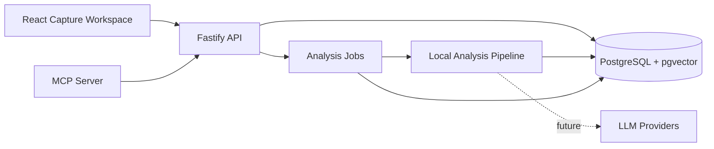

# IdeaHub Architecture

IdeaHub is a TypeScript monorepo built around a PostgreSQL-first knowledge system. The current MVP captures text into real vaults and projects, persists entries in PostgreSQL, creates the first entry version, queues analysis jobs, generates deterministic local embeddings, retrieves related context through pgvector, and stores reviewable analysis suggestions.

## System Overview

## Module Boundaries

| Module            | Responsibility                                                                          |
| ----------------- | --------------------------------------------------------------------------------------- |
| `apps/web`        | User-facing capture workspace for vaults, projects, and text entries.                   |
| `apps/api`        | Public HTTP API, OpenAPI contract, validation, persistence, and orchestration.          |
| `apps/mcp`        | Model Context Protocol server that integrates external AI tools through the public API. |
| `packages/shared` | Shared Zod schemas, enums, and TypeScript types.                                        |

## Data Flow

1. A user creates or selects a vault.
2. A user creates or selects a project inside that vault.
3. A user captures a text entry from the web workspace.
4. The API validates the request and persists the entry in PostgreSQL.
5. The API creates `entry_versions` version `1` with the initial captured content.
6. The API creates an `llm_jobs` analysis job in `queued` status.
7. The analysis pipeline chunks the entry, creates deterministic local embeddings, and stores them in `embeddings`.
8. The pipeline performs pgvector semantic retrieval inside the same vault.
9. The pipeline creates an `analysis_suggestions` row with summary, layer, tags, and candidate links.
10. The entry moves to `review` until a human approves or rejects the suggestion.

## Current Persistence Behavior

| Action            | Current behavior                                                                                         |
| ----------------- | -------------------------------------------------------------------------------------------------------- |
| Create vault      | Creates a vault for the development user and inserts an owner membership.                                |
| Create project    | Creates a project or subproject scoped to an existing vault.                                             |
| Create entry      | Persists content, sets `pending_analysis`, creates version `1`, and queues an analysis.                  |
| Process analysis  | Chunks content, writes pgvector embeddings, retrieves related context, and creates a pending suggestion. |
| Review suggestion | Approves or rejects a suggestion. Approval consolidates summary, layer, tags, and candidate links.       |
| Semantic search   | Embeds the query locally and retrieves matching chunks through PostgreSQL + pgvector.                    |
| Get entry         | Returns the entry with versions, tags, links, and analysis suggestions.                                  |

## Analysis Pipeline

The first pipeline is intentionally deterministic. It does not call an external LLM yet, which keeps local development, CI, and Docker validation independent from vendor credentials.

| Step       | MVP implementation                                                    | Future implementation                                      |
| ---------- | --------------------------------------------------------------------- | ---------------------------------------------------------- |
| Chunking   | Paragraph and fixed-length chunking.                                  | Token-aware chunking with overlap.                         |
| Embeddings | Local hash-based 1536-dimensional vectors for repeatable development. | Provider embeddings through OpenAI or another LLM vendor.  |
| Retrieval  | pgvector cosine distance inside the selected vault.                   | Hybrid semantic, keyword, graph, and permission-aware RAG. |
| Analysis   | Heuristic layer, summary, tag, and link suggestions.                  | LLM prompt using retrieved context and strict JSON output. |
| Human gate | Pending suggestions must be reviewed before consolidation.            | Same principle, with richer diff and provenance controls.  |

## Design Principles

- PostgreSQL is the source of truth.
- RAG must retrieve context before asking an LLM to propose links.
- AI output remains reviewable and reversible.
- MCP integrations use public API boundaries instead of importing internal API modules.
- Documentation is generated or updated close to the code that defines behavior.
