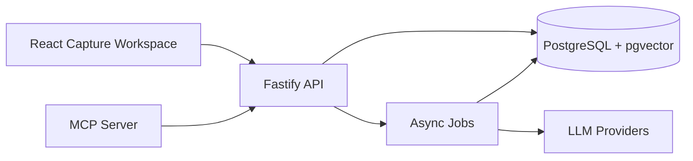

# IdeaHub Architecture

IdeaHub is a TypeScript monorepo built around a PostgreSQL-first knowledge system. The current MVP foundation captures text into real vaults and projects, persists entries in PostgreSQL, creates the first entry version, and queues analysis jobs for the future LLM/RAG pipeline.

## System Overview

## Module Boundaries

| Module            | Responsibility                                                                          |
| ----------------- | --------------------------------------------------------------------------------------- |
| `apps/web`        | User-facing capture workspace for vaults, projects, and text entries.                   |
| `apps/api`        | Public HTTP API, OpenAPI contract, validation, persistence, and orchestration.          |
| `apps/mcp`        | Model Context Protocol server that integrates external AI tools through the public API. |
| `packages/shared` | Shared Zod schemas, enums, and TypeScript types.                                        |

## Data Flow

1. A user creates or selects a vault.
2. A user creates or selects a project inside that vault.
3. A user captures a text entry from the web workspace.
4. The API validates the request and persists the entry in PostgreSQL.
5. The API creates `entry_versions` version `1` with the initial captured content.
6. The API creates an `llm_jobs` analysis job in `queued` status.
7. The future ingestion pipeline will chunk content, create embeddings, retrieve context through pgvector, and generate reviewable suggestions.

## Current Persistence Behavior

| Action         | Current behavior                                                                        |
| -------------- | --------------------------------------------------------------------------------------- |
| Create vault   | Creates a vault for the development user and inserts an owner membership.               |
| Create project | Creates a project or subproject scoped to an existing vault.                            |
| Create entry   | Persists content, sets `pending_analysis`, creates version `1`, and queues an analysis. |
| Get entry      | Returns the entry with versions, tags, links, and analysis suggestions.                 |

## Design Principles

- PostgreSQL is the source of truth.
- RAG must retrieve context before asking an LLM to propose links.
- AI output remains reviewable and reversible.
- MCP integrations use public API boundaries instead of importing internal API modules.
- Documentation is generated or updated close to the code that defines behavior.
