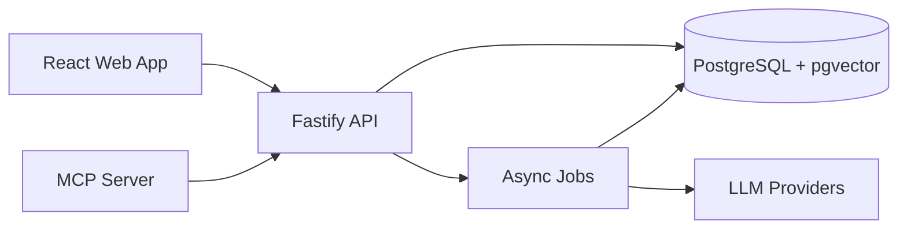

# IdeaHub Architecture

IdeaHub is a TypeScript monorepo built around a PostgreSQL-first knowledge system. The product captures text and voice, turns raw input into structured entries, retrieves related knowledge through pgvector, and prepares LLM-generated suggestions for human review.

## System Overview

## Module Boundaries

| Module            | Responsibility                                                                          |
| ----------------- | --------------------------------------------------------------------------------------- |
| `apps/web`        | User-facing capture, review, and visualization experience.                              |
| `apps/api`        | Public HTTP API, OpenAPI contract, validation, persistence, and orchestration.          |
| `apps/mcp`        | Model Context Protocol server that integrates external AI tools through the public API. |
| `packages/shared` | Shared Zod schemas, enums, and TypeScript types.                                        |

## Data Flow

1. A user captures text or audio in the web app.
2. The API validates the request and creates an entry/job.
3. The ingestion pipeline chunks content and creates embeddings.
4. Semantic retrieval finds related entries through pgvector.
5. LLM analysis proposes layers, tags, project placement, and links.
6. The user reviews suggestions before they become trusted knowledge.

## Design Principles

- PostgreSQL is the source of truth.
- RAG must retrieve context before asking an LLM to propose links.
- AI output remains reviewable and reversible.
- MCP integrations use public API boundaries instead of importing internal API modules.
- Documentation is generated or updated close to the code that defines behavior.
